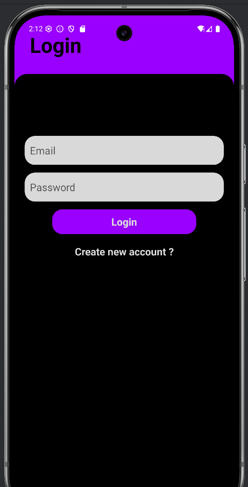
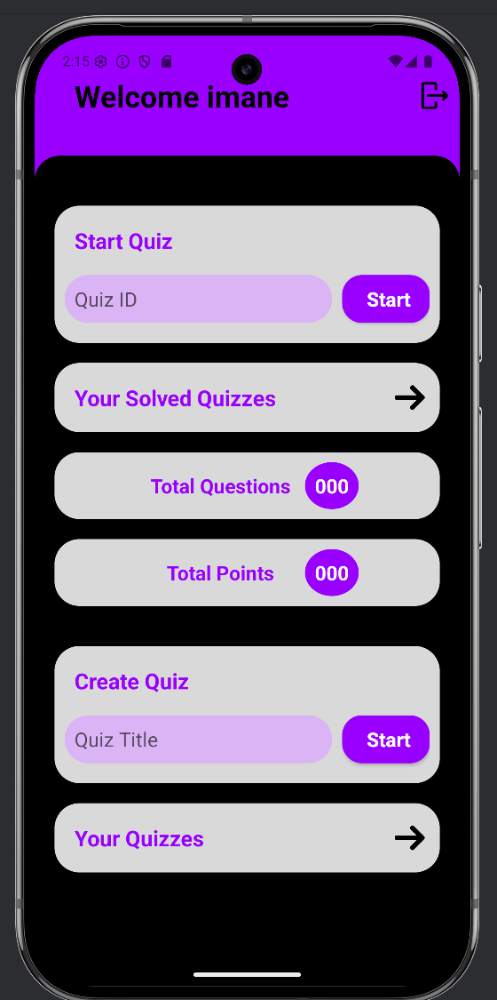
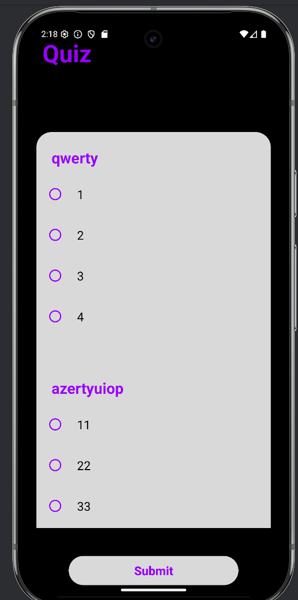
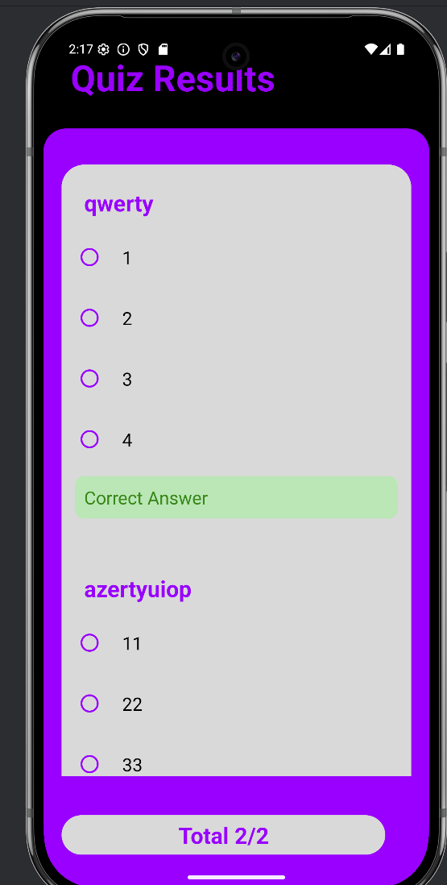

# Quiz Online (JOSKA_EXAM)


## 📌 Description du Projet  
L'application **Quiz Online (JOSKA_EXAM)** est une plateforme Android permettant de créer, partager et répondre à des quiz en ligne. Développée avec **Android Studio** et intégrant **Firebase**, elle offre une solution interactive pour des évaluations éducatives ou ludiques sans besoin de serveur complexe.  

## 🚀 Fonctionnalités Clés  
- **🔐 Authentification** : Inscription/connexion via Firebase.  
- **✏️ Création de Quiz** : Questions à choix multiples + génération de code unique.  
- **📲 Partage Instantané** : Rejoindre un quiz via un code.  
- **📊 Résultats** : Scores et corrections en temps réel.  

## 📸 Captures d'Écran  
  
*Écran de Connexion*

  
*Écran d'Inscription*

  
*Écran d'acceuil*

  
*Création d'un Quiz*

  
*Rejoindre un Quiz*

  
*Affichage des Résultats*


## 🛠️ Comment Lancer l'Application  
1. **Cloner le dépôt** :  
   ```bash
   git clone https://github.com/CHAKRELLAH44/JOSKA-EXAM.git
