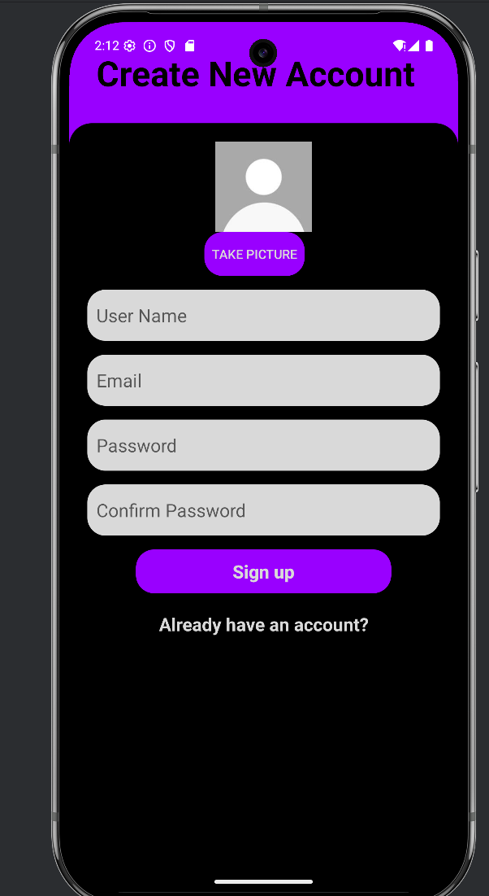

# Quiz Online (JOSKA_EXAM)

## 📌 Description du Projet  
L'application **Quiz Online (JOSKA_EXAM)** est une plateforme Android permettant de créer, partager et répondre à des quiz en ligne. Développée avec **Android Studio** et intégrant **Firebase**, elle offre une solution interactive pour des évaluations éducatives ou ludiques sans besoin de serveur complexe.  

## 🚀 Fonctionnalités Clés  
- **🔐 Authentification** : Inscription/connexion via Firebase.  
- **✏️ Création de Quiz** : Questions à choix multiples + génération de code unique.  
- **📲 Partage Instantané** : Rejoindre un quiz via un code.  
- **📊 Résultats** : Scores et corrections en temps réel.  

## 📸 Galerie (Cliquez pour agrandir)
<div align="center">

[](img/2.png)
[](img/1.png)

[](img/4.png)
[](img/3.png)

[](img/5.png)
</div>

- 
- 
- 

- ### Prérequis

- Android Studio (version récente recommandée).
- Un émulateur Android configuré (par exemple, **Nougat API 25**).
- Compte Firebase pour l'authentification et la base de données.
## 🛠️ Comment Lancer l'Application  
1. **Cloner le dépôt** :  
   ```bash
   git clone https://github.com/CHAKRELLAH44/JOSKA-EXAM.git
cd quiz-app
# Ouvrir dans Android Studio
